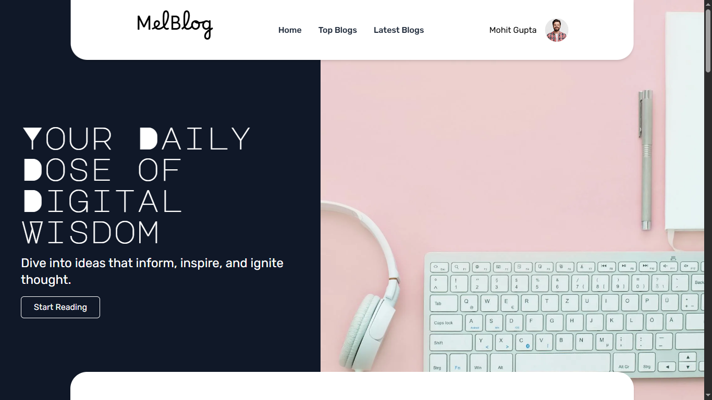
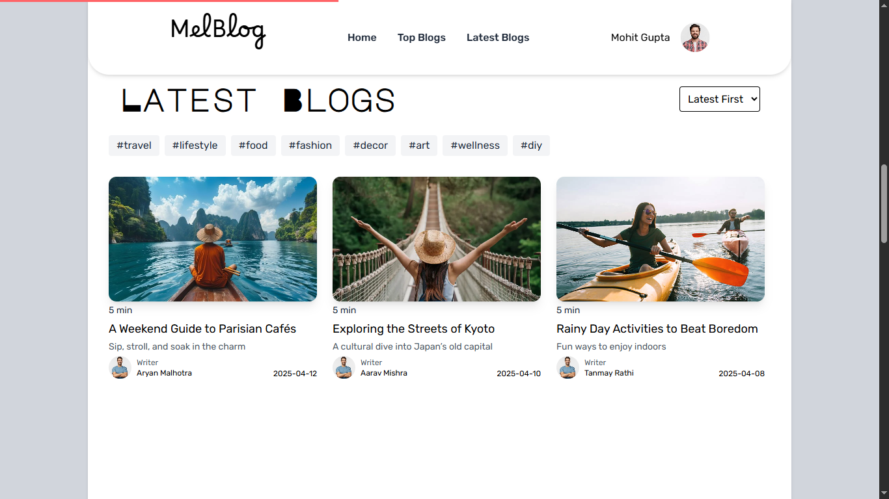

# 📝 MelBlog – Animated Blog Website

MelBlog is a responsive and animated blog homepage built with **React** and **Framer Motion**. It includes scroll-based progress indicators, animated cards, and an interactive pointer follower using `useSpring()` for smooth UI transitions.

## 🚀 Features

- ✅ Smooth scroll animations using `framer-motion`
- ✅ Animated blog cards on scroll
- ✅ Custom pointer follower animation using `useSpring`
- ✅ Sticky navbar with internal links
- ✅ Responsive layout with Tailwind CSS

# 🌐 Live Preview

Check out the live demo: [MelBlog Live](https://blogpage-qcee.onrender.com/)

## 📸 Preview




## 🔧 Tech Stack

- ⚛️ React.js
- 🎞 Framer Motion
- 🎨 Tailwind CSS
- 💡 Custom Hooks

## 📂 Folder Structure

```
src/
│
├── AllFiles/
|   |── card.jsx
│   ├── Footer.jsx
│   ├── HeroSection.jsx
|   |── LatestBlog.jsx
│   └── TopBlog.jsx
├── App.jsx
├── App.css
├── variants.js
└── main.jsx
```

## 📌 Setup Instructions

1. Clone the repository  
   ```bash
   git clone https://github.com/mellifluousguy/melblog.git
   ```
2. Navigate to the project folder
   ```bash
   cd melblog
   ```
3. Install dependencies
   ```bash
   npm install
   ```
4. Start the development server
   ```bash
   npm start
   ```

## 🧠 Learnings

- Worked with advanced framer-motion APIs
- Implemented spring-based pointer animation
- Practiced modern UI animation and UX effects

## 🙌 Acknowledgements

- Framer Motion Docs
- Tailwind CSS

## 📫 Contact

- Mohit Gupta
- 📧 mohitdeveloperg@gmail.com
- 🔗 [LinkedIn](https://linked.com/in/mellilfuousguy)
- 🐙 [GitHub](https://github.com/mellilfluousguy)

⭐ Star this repo if you like it. Pull requests are welcome!

---
